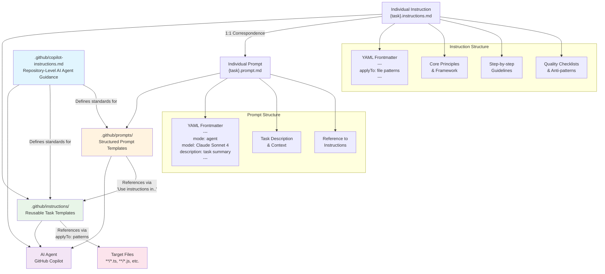

# SWE Copilot Kit

This repository serves as a comprehensive tool kit for GitHub Copilot, containing curated instructions, prompts, and best practices for AI-powered development workflows. It provides structured templates and guidelines to help developers and AI agents work more effectively with GitHub Copilot in production environments.

## Architecture Overview

The following diagram illustrates the relationship between the core components of this playbook:

### Component Relationships

| Component | Role | Relationships |
|-----------|------|---------------|
| **copilot-instructions.md** | Central configuration and standards | • Guides AI agent behavior • Sets standards for instructions & prompts • Defines project context |
| **instructions/** | Detailed "how-to" frameworks | • Applied to specific file types via `applyTo` • Referenced by prompts • Contain comprehensive guidelines |
| **prompts/** | Concise "what-to" requests | • Reference instruction files • Define execution context • Specify AI model preferences |
| **Target Files** | Code being processed | • Matched by instruction `applyTo` patterns • Processed using combined prompt + instruction logic |

## Prompts

List of common prompts.

## Instructions

List of common instructions.

## Important Features and Documents

[GitHub Copilot Chat cheat sheet](https://docs.github.com/en/copilot/reference/cheat-sheet?tool=vscode): Use this cheat sheet to quickly reference the most common commands and options for VS Code.

[GitHub Copilot Chat Cookbook](https://docs.github.com/en/copilot/tutorials/copilot-chat-cookbook): Find examples of prompts.

[GitHub Copilot Extensions](https://docs.github.com/en/copilot/tutorials/try-extensions): Build and try out GitHub Copilot extension.

[GitHub Copilot Agents in Preview](https://docs.github.com/en/copilot/concepts/agents): Delegate tasks to GitHub Copilot coding agent to work on in the background, and then monitor Copilot's progress.

[GitHub Copilot Spaces in Preview](https://docs.github.com/en/copilot/how-tos/provide-context/use-copilot-spaces): A persistent space that remembers your code, files, and preferences across conversations.

[AI Model Comparison](https://docs.github.com/en/copilot/reference/ai-models/model-comparison): Compare available AI models in Copilot Chat and choose the best model for your task.

[Auto-generate commit message in GitHub Desktop](https://docs.github.com/en/copilot/responsible-use/copilot-in-github-desktop#about-copilot-in-github-desktop): Responsible use of GitHub Copilot in GitHub Desktop.

## Community of Practices

GitHub Copilot Knowledge Base: <https://github.com/Talentica/github-copilot-knowledge-base>

Awesome GitHub Copilot Customizations: <https://github.com/github/awesome-copilot/>

## More Reads in This Playbook

1. [Prompt vs Instruction - What is the difference?](./docs/PROMPT_VS_INSTRUCTION.md)
2. [How to Control Deterministic Task from LLM Models](./docs/CONTROL_DETERMINISTIC_TASK.md)
